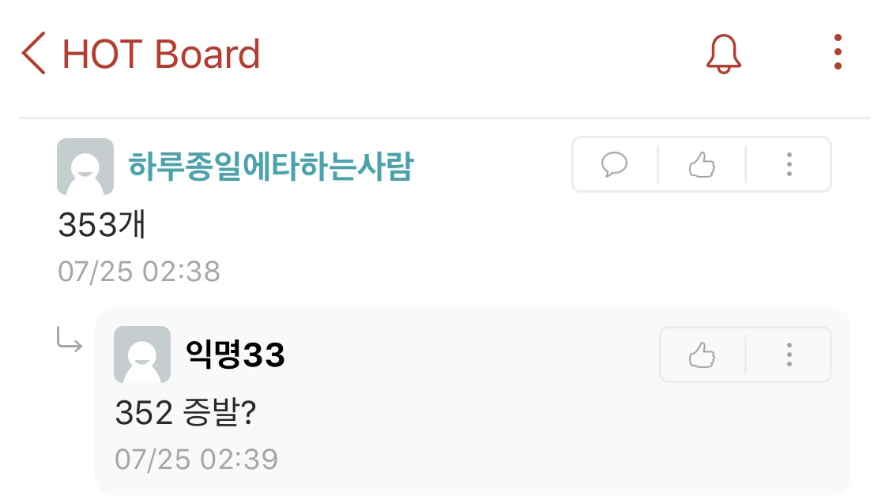

<h2 align="center">Everytime_dude 하루종일에타하는사람</h2>
<h3 align="center"> 파이썬 크롤링으로 게시글에 좋아요가 남겨질때마다 좋아요가 몇 개인지 댓글 달기 </h3>

완벽한 코드는 아닌 것 같으나 참고하실 수 있도록 올려요. Python Selenium, 웹드라이버 등을 조금이라도 써보셨으면 사용할 수 있을 거예요. 그리고 앞으로 제가 이 코드에 계속 신경쓰지는 못할 것 같아요.

## Flow :running:

1. 웹드라이버를 키고, 로그인을 하고, make_article을 통해서 게시글을 생성한다. (이때 comment()는 주석 처리 해주세요.)
2. 게시글이 작성되면 이번에는 make_article()을 주석 처리하고 comment(link_in = "생성된 게시글의 주소")를 통해서 이 프로그램이 무한 루프를 돌면서 그 게시글의 좋아요 개수를 계속 트래킹하고, 좋아요 개수가 변화하면 (늘어나면) 바뀐 좋아요 개수를 댓글로 답니다.

게시글 생성과 댓글 다는 무한 루프가 따로 실행되어야하는데 코드 하나에 있어서 불편하긴 한데, 한 번 게시글을 만들고 나면 이후에 comment()만 작동하면 되긴 해요. 그리고 make_article이 자유게시판에 제목과 글만 작성하는 거라서 그냥 직접 게시글을 작성하시고 게시글 링크만 comment() 함수에 넣어줘서 사용하는 것이 더 좋을 수 있어요.

## Error :angry:

에러는 아니지만 댓글을 정말 빨리 자주 달면 에브리타임에서 댓글을 자주 달 수 없다고 막아요. 현 코드에서는 그러한 팝업이 뜨면 확인을 누르고 댓글이 달아질 때까지 계속 반복하는 형식이라 가끔씩 숫자를 넘어버리는 경우도 있어요. (아래 사진) 그러나 이건 아마 어떻게 해결할 수는 없을 것 같아요.

## TMI :floppy_disk:

1. 몇 시간 정도 정말 대충 짠 거라서 고칠 만한 점이 있을 것 같긴 한데요, 저는 이제 안할거고 관심 있으신 분들 가지고 노시라고 올렸어요.
2. 컨셉을 위해 닉네임을 "하루종일에타하는사람"으로 바꿨는데 괜찮은 것 같네요.

